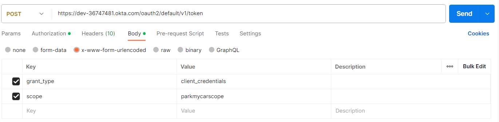

# Park My Car

Park my car is a simple java based car parking application.

It has 3 endpoints
* /park - parks a car given its license plate (string), returns a JSON with license
  plate and slot (if a slot is available) or an error message if the parking lot is full
* /slot - given a reference to a parking slot, will return a JSON with information
  about the slot: if it is empty or not and the license plate of the parked car (if
  any)
* /unpark - given a license plate, nds the car and frees the slot, returns a JSON
  with information about the car and the slot, or an error message if the car is not
  found

## Requirements

For building and running the application you need:

- [JDK 1.8](http://www.oracle.com/technetwork/java/javase/downloads/jdk8-downloads-2133151.html)
- [Maven 3](https://maven.apache.org)
- [Okta Account](https://developer.okta.com/signup/)

## Tech Stacks
* Spring Boot
* H2 In Memory Database
* Okta for Authentication
* Bucket4j for rate limiter
* Swagger

## Install and Run the Project

#### Clone project from github :

```shell
git clone https://github.com/BijayaBhaskar/park-my-car.git
```
#### Okta configuration :
* After successful registration , Next you need to create an application.
* Then Create new app integration.
* Create Custom scope in okta.
* In application.yml replace with your own issuer, clientId and clientSecret.

#### Run application locally :
There are several ways to run a Spring Boot application on your local machine. One way is to execute the `main` method in the `com.drop.assignment.ParkMyCarApplication` class from your IDE.

Alternatively you can use the [Spring Boot Maven plugin](https://docs.spring.io/spring-boot/docs/current/reference/html/build-tool-plugins-maven-plugin.html) like so:

```shell
mvn spring-boot:run
```
## Test Application


#### Create Auth Token

###### POST URL :
https://{your_okta_id}.okta.com/oauth2/default/v1/token
###### Authorization :
Basic Auth : <br />
username : {clientId} <br />
password : {clientSecret}

###### Request Body :


Use this Bearer token to access secured api endpoints.

###### Swagger URL :
http://localhost:8090/swagger-ui.html
